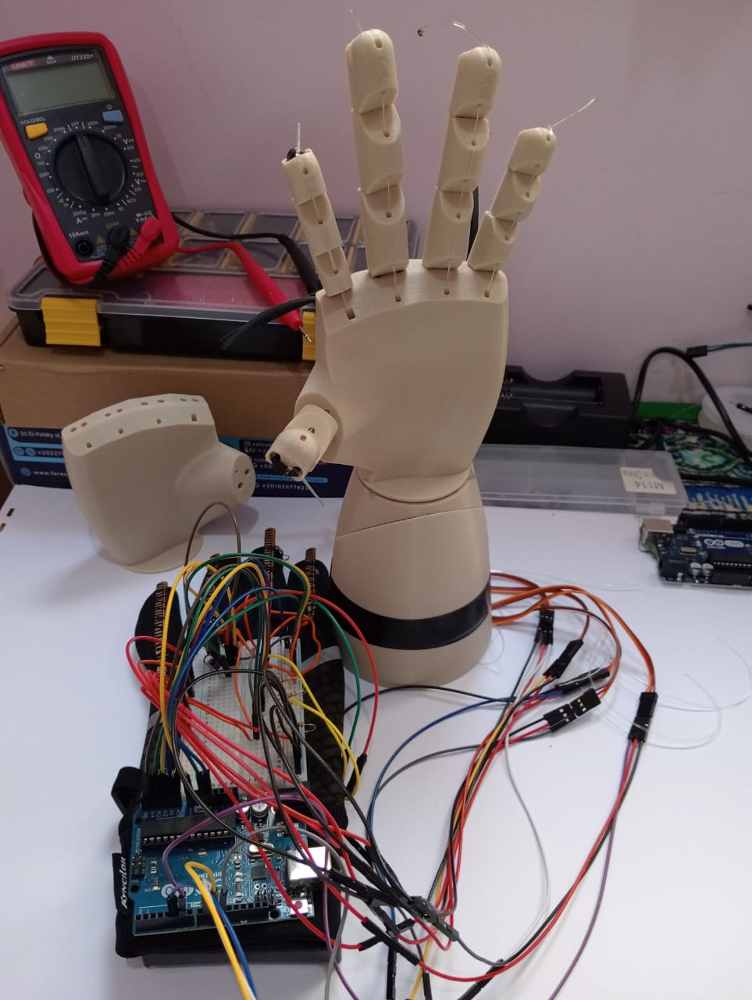

# 🤖 Robot Hand Controlled by Flex Sensors

A real robotic hand that responds to finger bending using flex sensors and Arduino UNO.

## 🧰 Tools Used
- Arduino UNO
- Flex Sensors (x5)
- Jumper Wires
- Breadboard
- Servo Motors (x5)
- C/C++ (Arduino IDE)

## ⚙️ How it Works
Each flex sensor corresponds to a finger. Analog values are read from the sensors and mapped to control real servo motors that move the fingers of the robotic hand.
## 🧾 Code Summary

The Arduino code reads analog values from five flex sensors (one for each finger), maps them to angles (0°–180°), and controls five servo motors to mimic finger bending in real-time.

Each sensor input is smoothed by comparing it with the last angle to avoid jittering, and then the corresponding servo motor is updated.

### Main Features:
- Uses `Servo.h` library to control servo motors.
- Maps raw sensor values to servo angles using `map()` and `constrain()`.
- Sends serial output for debugging (thumb, index, middle, ring, pinky).

You can find the full code in the file:  
(robot_hand.ino)

## 📷 Circuit Diagram
(WhatsApp Image 2025-07-01 at 11.19.42 PM.jpeg)
## 📷 real photo
> 🖼️ The following is a real photo of the working circuit captured during testing.

## 🚀 Future Improvements
- Improve servo responsiveness
- Design a 3D-printed hand structure
- Add wireless control module (e.g. Bluetooth)

## 🔗 Tinkercad Simulation

[Click here to view the simulation](https://www.tinkercad.com/things/bGdpcwAmCNJ-fabulous-kup)

---
Built with 💛 by Habiba Ahmed
