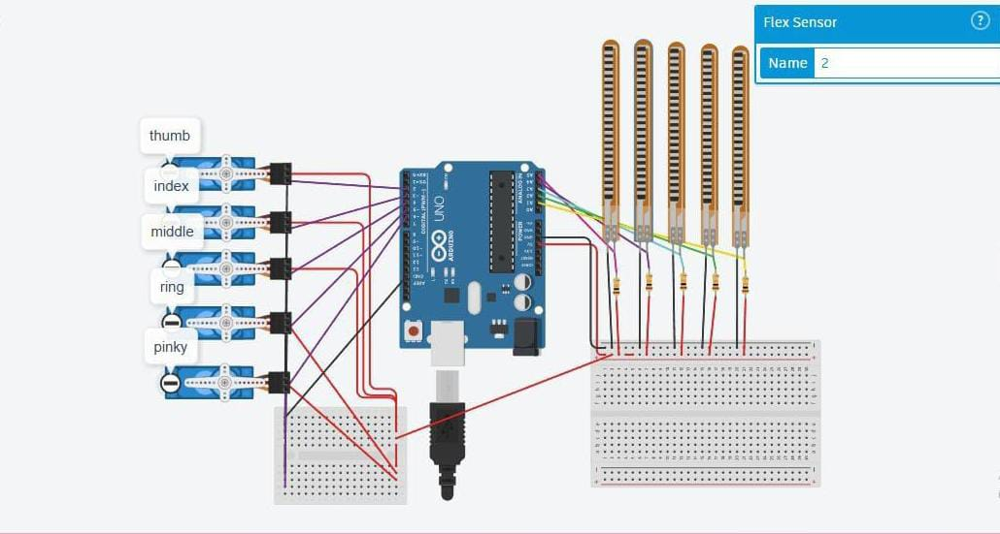

# 🤖 Robot Hand Controlled by Flex Sensors

A real robotic hand that responds to finger bending using flex sensors and Arduino UNO.

## 🧰 Tools Used
- Arduino UNO
- Flex Sensors (x5)
- Jumper Wires
- Breadboard
- Servo Motors (x5)
- C/C++ (Arduino IDE)

## ⚙️ How it Works
Each flex sensor corresponds to a finger. Analog values are read from the sensors and mapped to control real servo motors that move the fingers of the robotic hand.

## 📷 Circuit Diagram

## 🚀 Future Improvements
- Improve servo responsiveness
- Design a 3D-printed hand structure
- Add wireless control module (e.g. Bluetooth)

## 🔗 Tinkercad Simulation

[Click here to view the simulation](https://www.tinkercad.com/things/bGdpcwAmCNJ-fabulous-kup)

---
Built with 💛 by Habiba Ahmed
